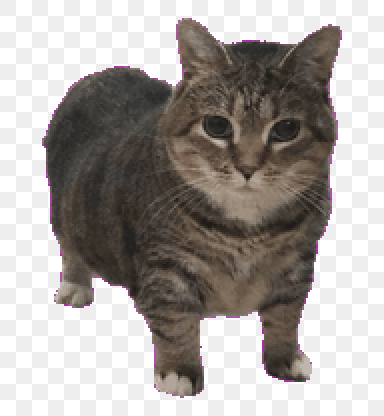
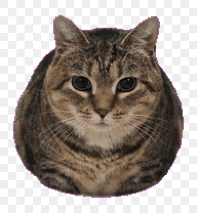
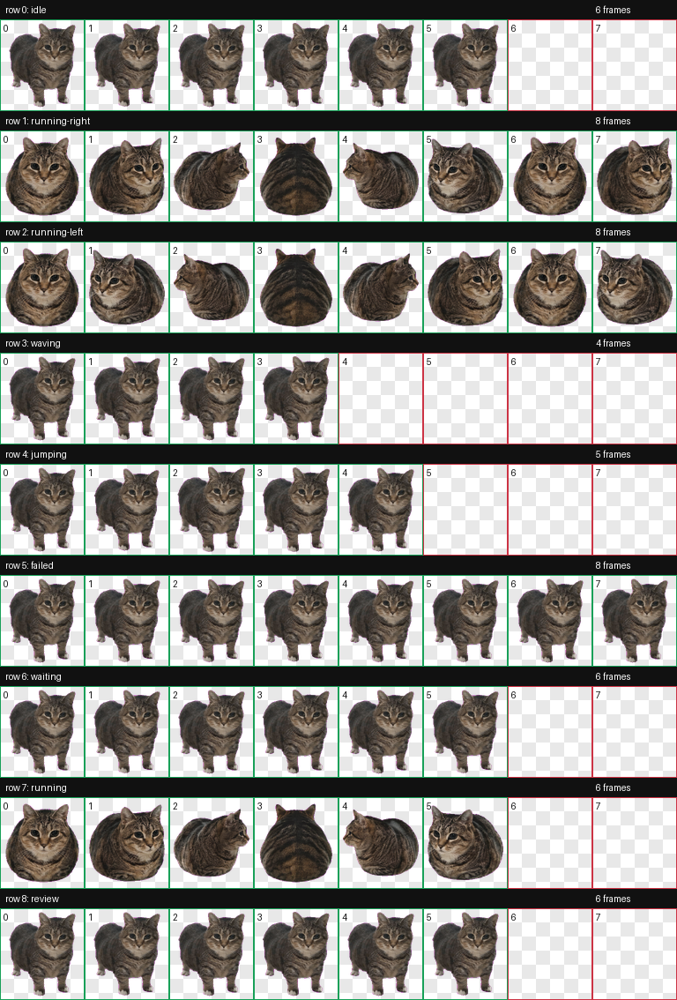

# oiiai Codex Pet

[Download v1.0.1](https://github.com/CarlHavingFun/oiiai-codex-pet/releases/tag/v1.0.1)

Custom Codex pet based on the OIIA/OIIAI spinning cat meme.

The final behavior keeps the meme timing:

- Idle/static states use the standing gray tabby cat with visible short feet.
- Running/spinning states use the round body version where the feet are hidden while the cat spins.

## Download

Download `oiiai-codex-pet.zip` from the latest release:

https://github.com/CarlHavingFun/oiiai-codex-pet/releases/latest

## Files

- `pet/pet.json` - Codex pet manifest.
- `pet/spritesheet.webp` - Final 8x9 Codex pet atlas.
- `qa/contact-sheet.png` - Full atlas contact sheet.
- `qa/idle-preview.gif` - Static/idle preview with visible feet.
- `qa/spin-preview.gif` - Spinning preview with round body and hidden feet.
- `source/` - ChatGPT web image sources used to build the final pet.

## Install

Copy the contents of `pet/` into your Codex pets directory:

```bash
mkdir -p ~/.codex/pets/oiiai
cp pet/pet.json pet/spritesheet.webp ~/.codex/pets/oiiai/
```

## Preview

Idle:



Spin:



Full atlas:



## Community Listing

Suggested title:

```text
oiiai - OIIA/OIIAI spinning cat Codex pet
```

Suggested description:

```text
Fan-made Codex pet based on the OIIA/OIIAI spinning cat meme. Idle states keep the tiny feet visible; spinning states use the round body with the feet hidden, so the meme timing reads correctly in motion.
```

## Custom Work

Want a meme pet, brand mascot, or character variant built in the same Codex pet format? Open an issue on this repo with the reference image, desired motion, and usage notes, or email:

```text
184219650@qq.com
```

## Support

If this pet saved you time or you want to support more Codex pet experiments, scan the Alipay QR code below.


